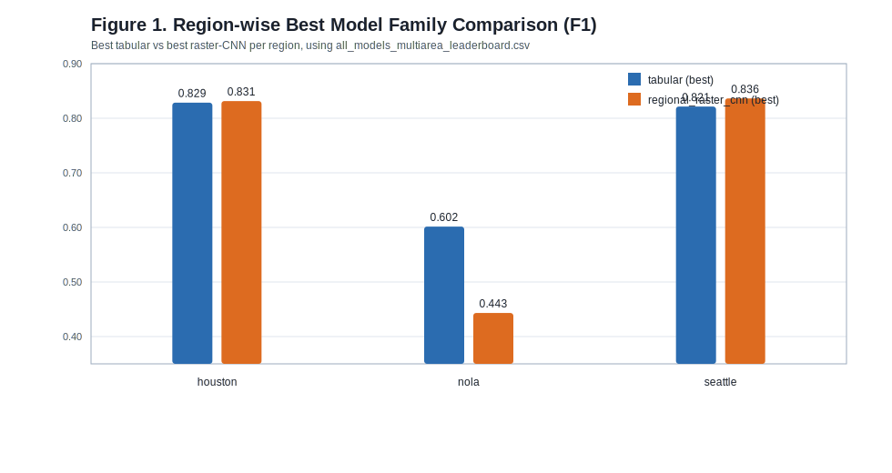
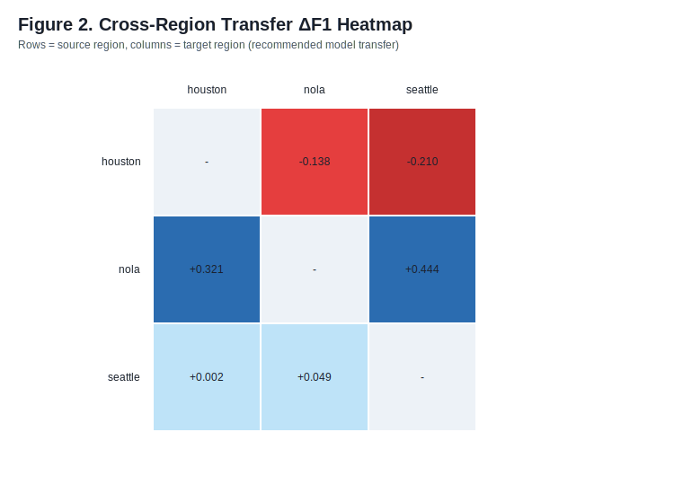
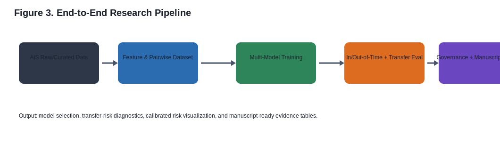
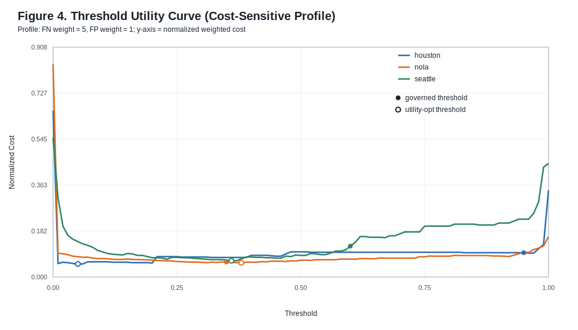

# AIS 기반 충돌위험 히트맵 논문 초안 v0.2 (Korean)

## 1. 연구 목적
본 연구는 AIS 시계열 기반 모델 학습을 통해 해역별 충돌위험도를 추정하고, 이를 heatmap+contour 형태로 시각화하여 운항 의사결정에 활용 가능한지를 검증한다.

## 2. 데이터/실험 설정 및 운영 프로토콜
- 데이터셋: Houston, NOLA, Seattle pooled pairwise
- 모델군: tabular + regional_raster_cnn + rule baseline
- 검증축: in-time, out-of-time, cross-region transfer, calibration(ECE)
- seed 기준: 10-seed 통계를 기본 보고 단위로 사용

### 2.1 데이터 필터링 정책
- `PP-01`: `mmsi + timestamp` 중복 제거
- `PP-02`: 위경도 범위 오류 제거
- `PP-03`: `sog < 0` 제거 및 비현실적 속력 이상치 점검
- `PP-04`: `heading` 결측 시 `cog` fallback
- `PP-05~PP-07`: MMSI별 정렬 후 gap segment 분리 및 소구간 보간

### 2.2 split 정책
- timestamp split으로 기본 시간 분리 성능을 측정한다.
- own-ship split/LOO로 기준 선박 일반화 성능을 분리 점검한다.
- own-ship case repeat로 반복 안정성(F1 std, CI 폭)을 함께 관리한다.

### 2.3 임계값 거버넌스
- 모델 선택은 `ECE gate(<=0.1)` 통과 후보 내에서 `F1 우선 + 분산 보조` 규칙을 적용한다.
- transfer 평가는 source에서 고정된 threshold를 target에 그대로 적용한다.
- threshold 변경 시 변경 근거, 승인, 영향(성능/보정)을 실험 로그에 함께 기록한다.

## 3. 모델 선택 결과 (10-seed 기준)

| region | model_family | model_name | f1_mean_10seed | ece_mean_10seed | f1_single_eval | ece_single_eval |
| --- | --- | --- | --- | --- | --- | --- |
| houston | tabular | hgbt | 0.8286 | 0.0229 | 0.8286 | 0.0229 |
| nola | tabular | hgbt | 0.6015 | 0.0237 | 0.6015 | 0.0237 |
| seattle | tabular | extra_trees | 0.8174 | 0.0300 | 0.8148 | 0.0289 |

해석: 3개 지역 모두 ECE gate를 만족한 후보 중 성능과 분산을 고려해 최종 모델이 선택되었고, Houston/NOLA는 `hgbt`, Seattle은 `extra_trees`가 채택됐다.

### 3.1 불확실성(95% CI)
| region | model_name | f1_mean_10seed | f1_std_10seed | f1_ci95_low_10seed | f1_ci95_high_10seed | ece_mean_10seed | ece_std_10seed | ece_ci95_low_10seed | ece_ci95_high_10seed |
| --- | --- | --- | --- | --- | --- | --- | --- | --- | --- |
| houston | hgbt | 0.8286 | 0.0000 | 0.8286 | 0.8286 | 0.0229 | 0.0000 | 0.0229 | 0.0229 |
| nola | hgbt | 0.6015 | 0.0000 | 0.6015 | 0.6015 | 0.0237 | 0.0000 | 0.0237 | 0.0237 |
| seattle | extra_trees | 0.8174 | 0.0261 | 0.8012 | 0.8336 | 0.0300 | 0.0017 | 0.0290 | 0.0311 |

- 해석 주의: CI는 `f1_std/ece_std` 기반 정규근사(95%)이며 `n=10 seed` 가정을 사용했다.

## 4. 전이 성능 핵심 결과

| source_region | target_region | recommended_model | delta_f1 | delta_f1_ci95 | target_ece |
| --- | --- | --- | --- | --- | --- |
| houston | nola | hgbt | -0.1383 | [-0.1651, -0.1145] | 0.0246 |
| houston | seattle | hgbt | -0.2103 | [-0.2395, -0.1788] | 0.0428 |
| nola | houston | hgbt | +0.3213 | [+0.2019, +0.4309] | 0.0159 |
| nola | seattle | hgbt | +0.4439 | [+0.3361, +0.5407] | 0.0260 |
| seattle | houston | extra_trees | +0.0021 | [-0.1367, +0.1413] | 0.0332 |
| seattle | nola | extra_trees | +0.0488 | [-0.0671, +0.1705] | 0.0272 |

해석: Houston source 전이는 음수 ΔF1이 관찰되며(domain shift), NOLA/Seattle source에서는 양수 또는 완만한 결과가 나타난다.

### 4.1 전이 불확실성(bootstrap 95% CI)
| source_region | target_region | recommended_model | source_f1_ci95 | target_f1_ci95 | delta_f1_ci95 | ci_method |
| --- | --- | --- | --- | --- | --- | --- |
| houston | nola | hgbt | [1.0000, 1.0000] | [0.8349, 0.8855] | [-0.1651, -0.1145] | bootstrap(n=300) |
| houston | seattle | hgbt | [1.0000, 1.0000] | [0.7605, 0.8212] | [-0.2395, -0.1788] | bootstrap(n=300) |
| nola | houston | hgbt | [0.3462, 0.4935] | [0.6954, 0.7771] | [+0.2019, +0.4309] | bootstrap(n=300) |
| nola | seattle | hgbt | [0.3462, 0.4935] | [0.8296, 0.8869] | [+0.3361, +0.5407] | bootstrap(n=300) |
| seattle | houston | extra_trees | [0.7088, 0.8916] | [0.7548, 0.8502] | [-0.1367, +0.1413] | bootstrap(n=300) |
| seattle | nola | extra_trees | [0.7088, 0.8916] | [0.8244, 0.8794] | [-0.0671, +0.1705] | bootstrap(n=300) |

- 해석 주의: transfer CI는 source/target prediction CSV 기반 bootstrap 추정치다.
- 추가 주의(고불확실성 경로): 고불확실성 경로 없음.

## 5. 절제분석: tabular vs raster-CNN

| region | tabular_model | tabular_f1 | raster_cnn_model | raster_cnn_f1 | delta_f1_tabular_minus_cnn | tabular_ece | raster_cnn_ece | delta_ece_tabular_minus_cnn | interpretation |
| --- | --- | --- | --- | --- | --- | --- | --- | --- | --- |
| houston | hgbt | 0.8286 | cnn_focal_temp | 0.8315 | -0.0029 | 0.0229 | 0.1458 | -0.1229 | trade-off or near-tie between families |
| nola | hgbt | 0.6015 | cnn_weighted | 0.4432 | +0.1583 | 0.0237 | 0.1019 | -0.0783 | tabular dominates both discrimination and calibration |
| seattle | logreg | 0.8214 | cnn_focal | 0.8364 | -0.0149 | 0.0482 | 0.2791 | -0.2310 | trade-off or near-tie between families |

요약 해석:
- houston: ΔF1(tabular-cnn)=-0.0029 (raster-CNN 우세), ΔECE(tabular-cnn)=-0.1229 (tabular 보정 우세).
- nola: ΔF1(tabular-cnn)=+0.1583 (tabular 우세), ΔECE(tabular-cnn)=-0.0783 (tabular 보정 우세).
- seattle: ΔF1(tabular-cnn)=-0.0149 (raster-CNN 우세), ΔECE(tabular-cnn)=-0.2310 (tabular 보정 우세).

## 6. 그림 도식 구성
- Figure 1: 
- Figure 2: 
- Figure 3: 
- Figure 4: 

## 7. 용어 매핑 (KOR/ENG)

| concept | korean_term | english_term | usage_note_ko | usage_note_en |
| --- | --- | --- | --- | --- |
| Collision Risk Heatmap | 충돌위험 히트맵 | collision-risk heatmap | 공간 격자에서 상대 위험도를 색상 강도로 표현한 지도 | A map that encodes relative risk intensity over spatial grids. |
| Safety Contour | 안전도 등고선 | safety contour | 동일 위험 임계값을 연결한 곡선; 의사결정 경계로 사용 | A curve connecting equal-risk thresholds for decision boundaries. |
| Cross-Region Transfer | 교차 해역 전이 | cross-region transfer | source 해역 학습모델을 target 해역에 적용한 일반화 성능 평가 | Generalization test applying a source-region-trained model to a target region. |
| Domain Shift | 도메인 시프트 | domain shift | 학습/적용 해역 분포 차이로 성능이 변하는 현상 | Performance drift caused by source-target distribution mismatch. |
| Expected Calibration Error | 기대 보정 오차 | expected calibration error (ECE) | 예측 확률과 실제 빈도의 불일치 정도; 낮을수록 바람직 | Mismatch between predicted confidence and empirical frequency; lower is better. |
| Threshold Governance | 임계값 거버넌스 | threshold governance | 운영 임계값 변경 시 근거/승인/추적 규칙 | Policy for rationale, approval, and traceability of threshold changes. |
| Own Ship | 자선(own ship) | own ship | 분석 기준 선박. 최초 등장 시 자선(own ship)으로 병기 | Reference vessel in analysis; write as 자선(own ship) on first Korean mention. |
| Rule Baseline | 규칙 기반 기준선 | rule baseline | 모델 성능 비교를 위한 비학습 규칙 기반 참조선 | Non-learning reference baseline for model-comparison benchmarking. |

상세 용어 가이드는 `terminology_mapping_v0.2_2026-04-09.md`를 따른다.

## 8. 이중언어 그림 캡션
- KOR/ENG 캡션 세트: `figure_captions_bilingual_v0.2_2026-04-09.md`

## 9. 시나리오 시각화 근거
- Houston scenario: `../../results/2026-04-04-expanded-10seed/houston_report_figure.svg`
- NOLA scenario: `../../results/2026-04-04-expanded-10seed/nola_report_figure.svg`
- Seattle scenario: `../../results/2026-04-04-expanded-10seed/seattle_report_figure.svg`

## 10. 제출 포맷 메모
- 현 단계에서는 `docs`에 원고를 작성/버전관리하는 방식이 적합하다.
- 최종 제출은 저널/학회 템플릿(Word/LaTeX)으로 변환하되, 내용 원천은 `docs/manuscript`를 single source로 유지한다.

## 11. 제출 준비 산출물
- LaTeX 제출 템플릿: `manuscript_submission_template_v0.2_2026-04-09.tex`
- 정합성 점검 리포트: `manuscript_consistency_report_v0.2_2026-04-09.md`
- 정합성 자동 점검 결과: `PASS` (6/6)

## 12. 선행연구 근거 매트릭스
- 근거 매트릭스: `prior_work_evidence_matrix_v0.2_2026-04-09.md`
- 심사관 관점에서 핵심 claim별 문헌 근거/빈틈/보완 action을 연결했다.

## 13. 심사관 관점 우선 TODO
- 상세 TODO: `examiner_critical_todo_v0.2_2026-04-09.md`
- 이 TODO는 novelty 서술, 통계 검정, 외부 검증 범위, 운영 임계값 해석을 우선 보완 대상으로 정의한다.

## 14. 통계 유의성 부록
- 유의성 요약 CSV: `model_family_significance_summary.csv`
- 부록 문서: `statistical_significance_appendix_v0.2_2026-04-09.md`
- 검정 구성: paired exact sign test + paired exact permutation test, Holm 보정(p<0.05)으로 다중비교를 제어했다.

| region | tabular_model | raster_cnn_model | n_pairs | f1_delta_mean_tabular_minus_cnn | f1_permutation_p_holm | ece_delta_mean_tabular_minus_cnn | ece_permutation_p_holm | interpretation |
| --- | --- | --- | --- | --- | --- | --- | --- | --- |
| houston | hgbt | cnn_weighted | 10 | +0.0089 | 0.3359 | -0.1446 | 0.0060 | no significant F1 difference; tabular significantly lower ECE |
| nola | hgbt | cnn_weighted | 10 | +0.1559 | 0.0117 | -0.0870 | 0.0060 | tabular significantly higher F1; tabular significantly lower ECE |
| seattle | logreg | cnn_weighted | 10 | +0.0136 | 0.0117 | -0.2572 | 0.0060 | tabular significantly higher F1; tabular significantly lower ECE |

핵심 해석:
- houston: ΔF1=+0.0089 (Holm p=0.3359), ΔECE=-0.1446 (Holm p=0.0060)
- nola: ΔF1=+0.1559 (Holm p=0.0117), ΔECE=-0.0870 (Holm p=0.0060)
- seattle: ΔF1=+0.0136 (Holm p=0.0117), ΔECE=-0.2572 (Holm p=0.0060)

## 15. 전이 경로 통계 부록(bootstrap)
- 전이 경로 유의성 CSV: `transfer_route_significance_summary.csv`
- 부록 문서: `transfer_route_significance_appendix_v0.2_2026-04-09.md`

| source_region | target_region | recommended_model | observed_delta_f1 | bootstrap_delta_ci95 | bootstrap_p_two_sided | direction_probability | interpretation |
| --- | --- | --- | --- | --- | --- | --- | --- |
| houston | nola | hgbt | -0.1383 | [-0.1634, -0.1152] | 0.0000 | 1.0000 | statistically_supported_negative_transfer |
| houston | seattle | hgbt | -0.2103 | [-0.2413, -0.1767] | 0.0000 | 1.0000 | statistically_supported_negative_transfer |
| nola | houston | hgbt | +0.3213 | [+0.2332, +0.3986] | 0.0000 | 1.0000 | statistically_supported_positive_transfer |
| nola | seattle | hgbt | +0.4439 | [+0.3545, +0.5174] | 0.0000 | 1.0000 | statistically_supported_positive_transfer |
| seattle | houston | extra_trees | +0.0021 | [-0.0977, +0.1154] | 0.9670 | 0.5165 | not_conclusive |
| seattle | nola | extra_trees | +0.0488 | [-0.0393, +0.1521] | 0.2960 | 0.8520 | not_conclusive |

핵심 해석:
- houston->nola: ΔF1=-0.1383, bootstrap p=0.0000, direction_prob=1.0000
- houston->seattle: ΔF1=-0.2103, bootstrap p=0.0000, direction_prob=1.0000
- nola->houston: ΔF1=+0.3213, bootstrap p=0.0000, direction_prob=1.0000
- nola->seattle: ΔF1=+0.4439, bootstrap p=0.0000, direction_prob=1.0000
- seattle->houston: ΔF1=+0.0021, bootstrap p=0.9670, direction_prob=0.5165
- seattle->nola: ΔF1=+0.0488, bootstrap p=0.2960, direction_prob=0.8520

## 16. 임계값 유틸리티 부록 (운영 비용 프로파일)
- 유틸리티 곡선 CSV: `threshold_utility_curve_summary.csv`
- 운영점 요약 CSV: `threshold_utility_operating_points.csv`
- 유틸리티 부록 문서: `threshold_utility_appendix_v0.2_2026-04-09.md`

| region | model_name | governed_threshold | utility_opt_threshold | threshold_shift | governed_f1 | opt_f1 | cost_reduction_pct | governed_fp | governed_fn | opt_fp | opt_fn |
| --- | --- | --- | --- | --- | --- | --- | --- | --- | --- | --- | --- |
| houston | hgbt | 0.95 | 0.05 | -0.90 | 0.8286 | 0.8372 | +46.43 | 1 | 11 | 10 | 4 |
| nola | hgbt | 0.35 | 0.38 | +0.03 | 0.6015 | 0.6250 | +5.38 | 43 | 10 | 38 | 10 |
| seattle | extra_trees | 0.60 | 0.36 | -0.24 | 0.8148 | 0.8308 | +47.50 | 5 | 15 | 17 | 5 |

핵심 해석:
- houston: governed=0.95 -> utility-opt=0.05, 비용절감=+46.43%, F1변화=+0.0086
- nola: governed=0.35 -> utility-opt=0.38, 비용절감=+5.38%, F1변화=+0.0235
- seattle: governed=0.60 -> utility-opt=0.36, 비용절감=+47.50%, F1변화=+0.0160
